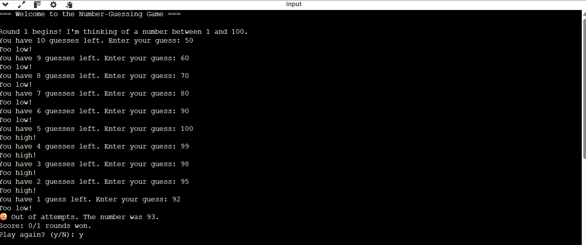
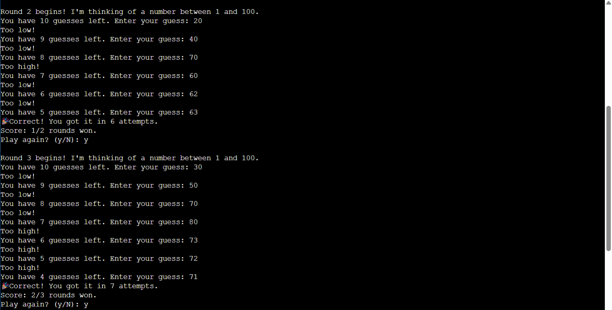
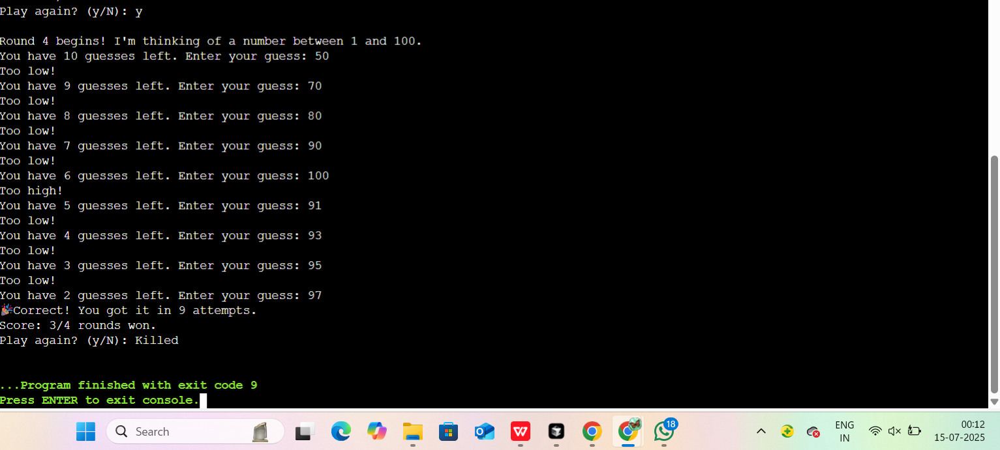
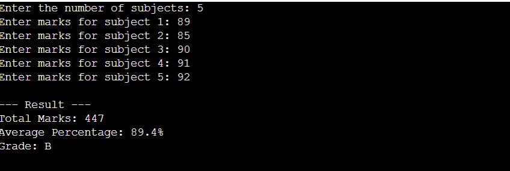
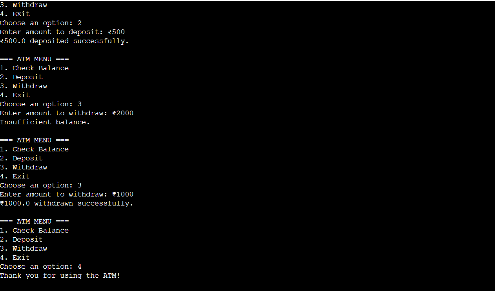

# 🎮 Mini Java Projects

This repository contains simple Java console-based projects to improve logic building and core programming skills.

---

## ✅ Task 1: Number Guessing Game

A guessing game where the player must find a number between 1 and 100 within a limited number of tries.

### Features:
- Random number generation
- Attempt limit (default: 10)
- High/Low feedback
- Score tracking and replay option

---
### Outputs :
- Round 1:

- Round 2 & 3:

- Round 4:

## task 2: Student Marks & Grade Calculator

✅ Goal
Build a simple Java program that:

Takes marks as input

Calculates total and average

Assigns a grade

Displays a summary report

📌 Features:

User Input

Accepts marks (out of 100) for multiple subjects.

Total Calculation

Adds all entered marks.

Average Percentage

Uses:

ini
Copy
Edit
average = total marks / number of subjects
Grade Assignment

Percentage (%)	Grade
90 - 100	A
80 - 89	B
70 - 79	C
60 - 69	D
50 - 59	E
Below 50	F

Result Display

Total Marks

Average Percentage

Final Grade

🛠️ Technologies Used:
Language: Java

Concepts: Arrays, Loops, Conditionals, Scanner (user input)

## output:

## task3: ATM Interface – Java Console App

🎯 Goal
Simulate a basic ATM system in Java that allows a user to:

✅ Check balance

✅ Deposit money

✅ Withdraw money

📌 Features:
Menu-Driven Interface

Text-based options for user to choose actions.

BankAccount Class

Holds and updates user's balance.

Methods: deposit(), withdraw(), checkBalance()

ATM Class

Handles user input and displays options.

Validates transactions and prevents over-withdrawals.

Input Validation

Prevents invalid amounts (e.g., negative values or overdrawing).

Clear Output Messages

Confirms deposits, withdrawals, and shows current balance.

🛠️ Technologies Used
Java (Core)

Concepts: Classes, Methods, Scanner, Conditionals, Loops

## output:

